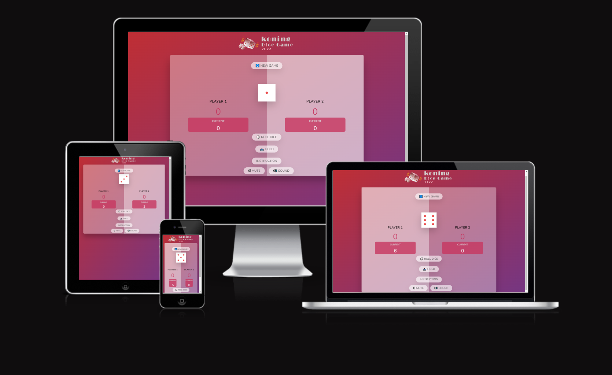
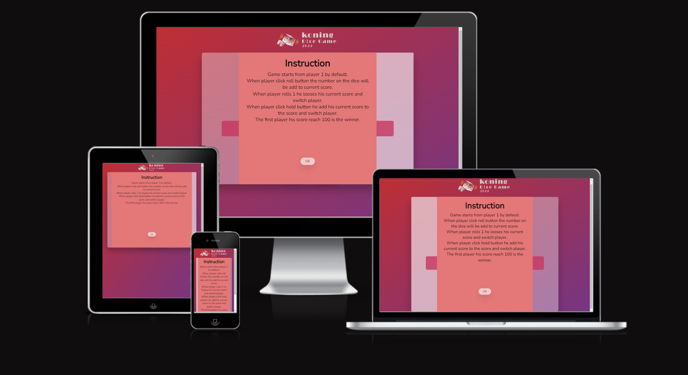
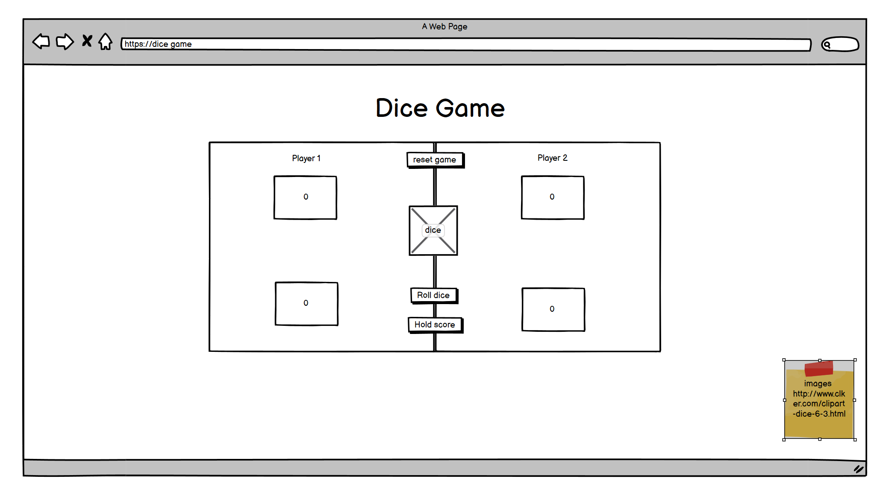
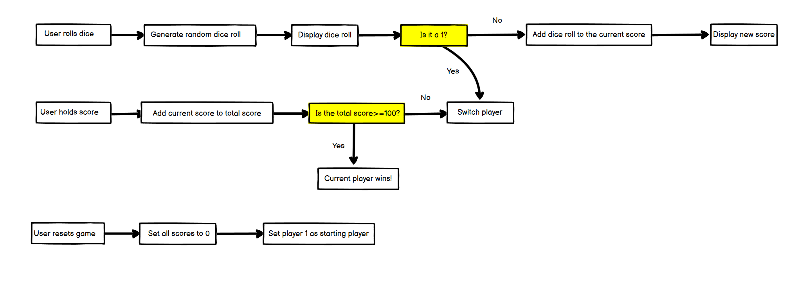
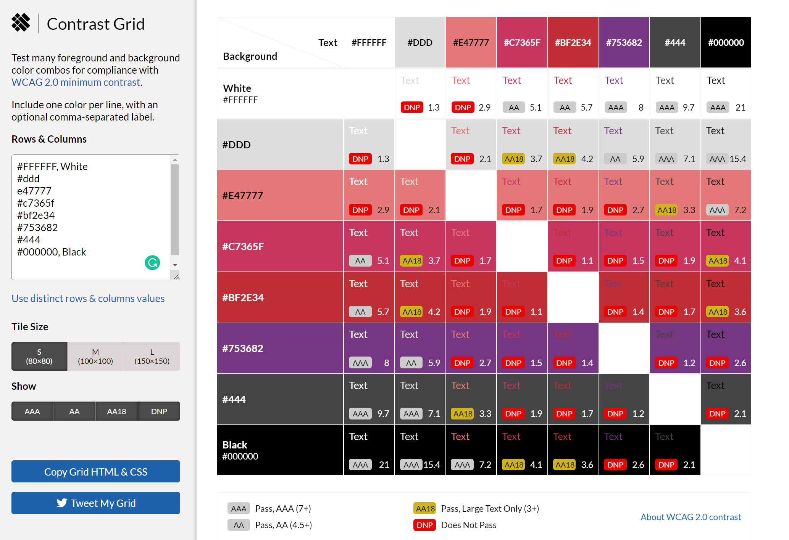
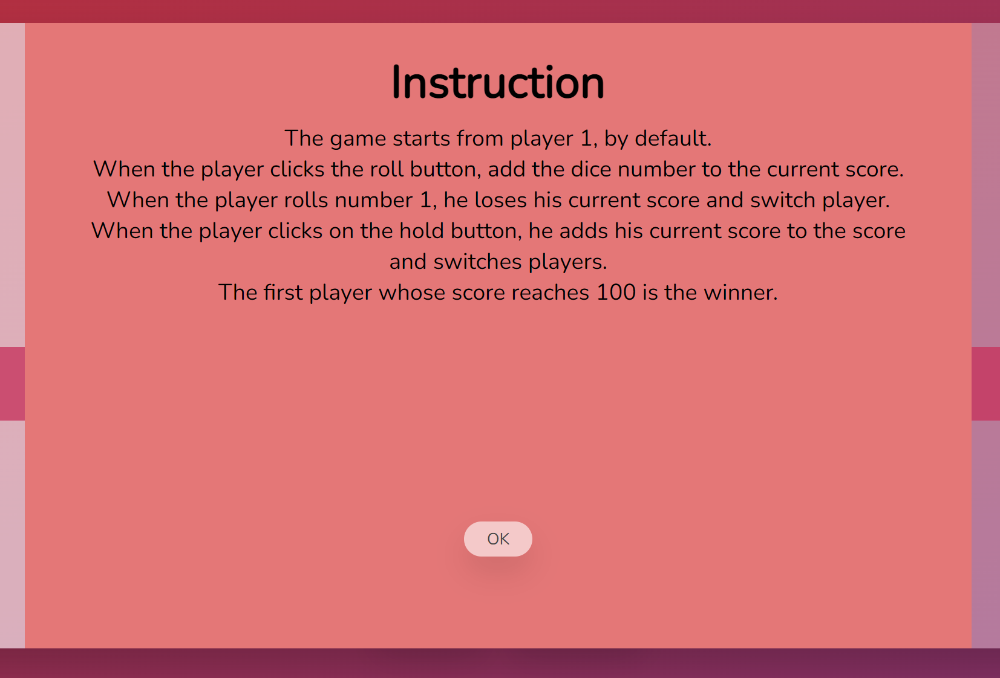
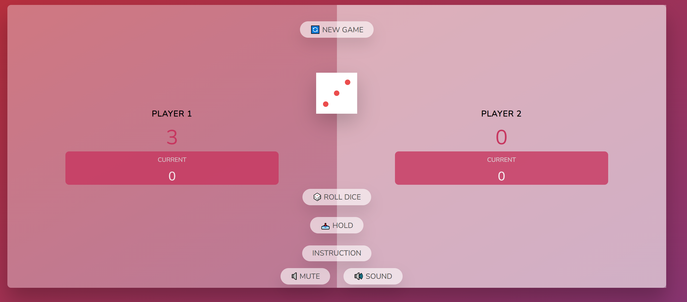
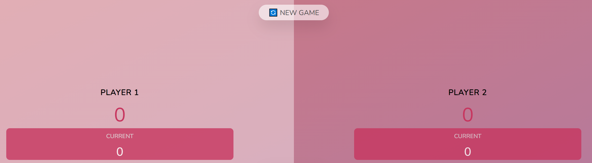
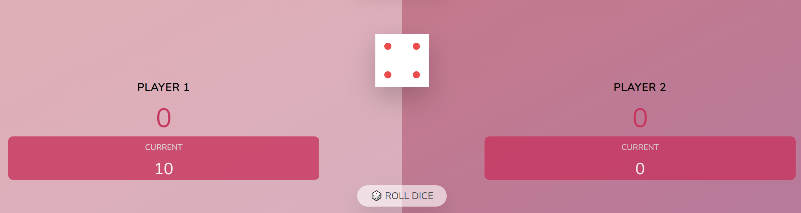
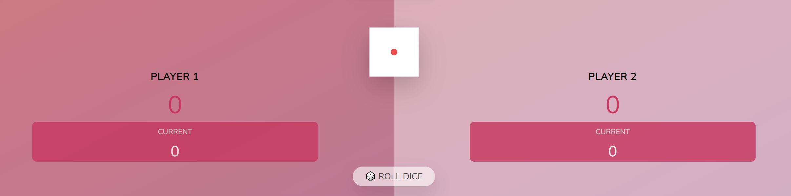

# Dice Game
- Dice Game is a site that hopes to demonstrate how pure JavaScript works in a real-world context. The site will be targeted users who love to implement more advanced JavaScript concepts.
- Dice Game is a fully responsive JavaScript dice game that will allow users to have fun playing together.
- Dice Game site will show the users the instruction of the game when:
  - The page is loaded.
  - The instruction is clicked.
- Dice Game site allow users to set the sound to active or mute.

# Navigator

- [**User experience UX**](<#user-experience-ux>)
    - [User stories](<#user-stories>)
    - [Wireframes](<#wireframes>)
    - [Flow chart diagram](<#flow-chart-diagram>)
    - [Site structure](<#site-structure>)
    - [Design choices](<#design-choices>)
       - [Typography](<#typography>)
       - [Color scheme](<#color-scheme>)
- [**Features**](<#features>)
    - [Existing features](<#existing-features>)
         - [Header](<#header>)
         - [Instruction](<#instruction>)
         - [Game Area](<#game-area>)
         - [Java script functions](<#java-script-functions>)   
    - [Future features](<#future-features>)
- [**Technologies used**](<#technologies-used>)         
- [**Testing**](<#testing>)
    - [Code Validation](<#code-validation>)
    - [Responsiveness Test](<#responsiveness-test>)
    - [Browser Compatibility](<#browser-compatibility>)
    - [Lighthouse](<#lighthouse>)
    - [Fixed bugs](<#Fixed-bugs>)
- [**Deployment**](<#deployment>)
    - [To deploy the project](<#to-deploy-the-project>)
    - [To fork the repository on GitHub](<#to-fork-the-repository-on-github>)
    - [To create a local clone of this project](<#to-create-a-local-clone-of-this-project>)
- [**Credits**](<#credits>)
    - [Content](<#content>)
    - [Media](<#media>)     
- [**Acknowledgements**](<#acknowledgements>)    

# User experience (UX)

## User stories

- As a user, I want to be able to know the instructions of the game.
- As a user, I want to understand the purpose of this site upon loading it.
- As a user, I want to know which player is active.
- As a user, I want to see the dice rolling.
- As a user, I want to hear the sound effect on the button click.
- As a user, I want to know scours.
- As a user, I want to know the winner.

[Back to top](<#navigator>)

## Wireframes

- Wireframe of the dice game produced in [Balsamiq](https://balsamiq.com).
- The wireframe display a desktop computer.
- No need for small screens wireframes because the game's width is 70% of the page.

[Back to top](<#navigator>)

## Flow chart diagram

- Game steps overview.
- Explain the flow of the game along with the playing scenarios.
- Shows the sequence of triggering the game's functionalities.
- Plan and write efficient functions.
- Game rules:
   - The game starts from player 1, by default.
   - When the player clicks the roll button, add the dice number to the current score.
   - When the player rolls number 1, he loses his current score and switch player.
   - When the player clicks on the hold button, he adds his current score to the score and switches players.
   - The first player whose score reaches 100 is the winner.

[Back to top](<#navigator>)

## Site structure

- Dice Game has one page contain game area.
 
[Back to top](<#navigator>)

## Design choices

  ### Typography
  - The fonts chosen were 'Nunito' for the body text. It fall back to sans-serif respectively.
  - 'Nunito' is used for the body text as it provides a nice contrast to the game, and it easy to read. 

  ### Color scheme
  - Use the color group to get the [contrast-grid](https://contrast-grid.eightshapes.com/).

[Back to top](<#navigator>)

# Features 

## Existing features

### Header
-  It contains the logo of the site.

[Back to top](<#navigator>)

### Instruction
-  It shows players game instructions.

[Back to top](<#navigator>)

### Game area
- It contains two player sections, six buttons, and a dice.
- The player section has the player's name, score, and current score.
- The user will see the buttons easily (New game, Roll dice, Hold, Instruction, Sound, Mute) and click on them.
- The game area will allow the user to play the dice game and control the sound effect.

[Back to top](<#navigator>)

### Java script functions
- New game button on click it will:
  - Set the variable back to 0.
  - Make player 1 active.
  - Hide the dice.
  - Remove winner class.
  - Set game playing to true.

[Back to top](<#navigator>)

- Roll dice button on click it will:
  - Generate random dice roll.
  - Display dice roll.
  - Check the dice if (dice > 1) add the dice number to the current score of the player.
  - Check the dice if (dice = 1) switch player.
   

[Back to top](<#navigator>)

## Future features

[Back to top](<#navigator>)

# Technologies used
- [HTML5](https://html.spec.whatwg.org/) - provides the content and structure for the website.
- [CSS](https://www.w3.org/Style/CSS/Overview.en.html) - provides the styling.
- [JavaScript](https://developer.mozilla.org/en-US/docs/Web/JavaScript) - provides functions to make the game interactive with players.
- [Balsamiq](https://balsamiq.com/wireframes/) - used to create the wireframes.
- [Gitpod](https://www.gitpod.io/#get-started) - used to deploy the website.
- [Github](https://github.com/) - used to host and edit the website.

[Back to top](<#navigator>)

# Testing 

## Code Validation

### HTML

* No errors were returned when passing through the official [W3C validator](https://validator.w3.org/)

### CSS
  - No errors were found when passing through the official [W3C validator](https://jigsaw.w3.org/css-validator/)

[Back to top](<#navigator>)

## Responsiveness Test

* The responsive tests were exercised by using [Google Chrome DevTools](https://developer.chrome.com/docs/devtools/).

|        | iPad mine | Galaxy S5 | iPhone 6/7/8 | iPad | iPad Pro | iPhone 6/7/8 plus | Display >1200px |
|--------|-----------|-----------|--------------|------|----------|-------------------|-----------------|
| Text   | pass      | pass      | pass         | pass | pass     | pass              | pass            |
| Images | pass      | pass      | pass         | pass | pass     | pass              | pass            |

[Back to top](<#navigator>)

## Browser Compatibility

- The dancing together site was tested on the following browsers Google Chrome, Safari and Mozilla Firefox.
- Appearance, functionality and responsiveness were consistent on a range of different device sizes and browsers.

[Back to top](<#navigator>)

## Lighthouse
The site was also tested using [Google Lighthouse](https://developers.google.com/web/tools/lighthouse) in Chrome Developer Tools to test each of the pages for:
- Performance - How the page performs whilst loading.
- Accessibility - Is the site accessible for all users and how can it be improved.
- Best Practices - Site conforms to industry best practices.
- SEO - Search engine optimization. Is the site optimized for search engine result rankings.

[Back to top](<#navigator>)

## Fixed bugs

[Back to top](<#navigator>)

# Deployment

## To deploy the project
The site deployed to GitHub pages. The steps to deploy a site are as follows:
  1. In the Dance together gitHub repository, go to **settings** tap.
  2. In Settings, navigate to the **Pages** tab on the left-hand side.
  3. Under **Source**, select the branch to **main**, then click **save**.
  4. Once the main branch has been selected, the page will be automatically deployed successfully on the [Koning Dice Game 2022](https://shahemnezameddin.github.io/Dice-game/) site.

[Back to top](<#navigator>)

## To fork the repository on GitHub
A copy of the GitHub Repository can be made by forking the GitHub account. This copy can be viewed and changes can be made to the copy without affecting the original repository. Take the following steps to fork the repository;
1. Log in to **GitHub** and locate the [repository](https://github.com/ShahemNezamEddin/Dancing-together).
2. On the right-hand side of the page inline with the repository name, is a button called **'Fork'**. Click on the button to create a copy of the original repository in your GitHub Account.

[Back to top](<#navigator>)

## To create a local clone of this project
The method for cloning a project from GitHub is below:

1. Under the repository’s name, click on the **code** tab.
2. In the **Clone with HTTPS** section, click on the clipboard icon to copy the given URL.
3. In your IDE of choice, open **Git Bash**.
4. Change the current working directory to where you want the cloned directory to be made.
5. Type **git clone**, then paste the URL copied from GitHub.
6. Press **enter**, and the local clone will be created.

[Back to top](<#navigator>)

# Credits 

### Content 

- The font came from [Google Fonts](https://fonts.google.com/).
- The color palate was compiled by:
  - [Contrast grid](https://contrast-grid.eightshapes.com/).
- The wireframes were created by [Balsamiq](https://balsamiq.com/wireframes/).
- The Logo in the header was designed by **Nahla Nezam Eddin**
- The emoji in buttons were taken from [emojicombos](https://emojicombos.com/bowling).
- The game idea came from Code Institute course materials and youtube videos.
- The inspiration for the game came from Love Maths project and  rock, paper, and scissors game.

[Back to top](<#navigator>)

### Media

- The images used in the game are from [clker](http://www.clker.com/clipart-dice-6-3.html)

[Back to top](<#navigator>)

# Acknowledgements
I want to thank:
- My mentor [Precious Ijege](https://www.linkedin.com/in/precious-ijege-908a00168/) for guidance and support.
- Slack community and Code Institute crew for their help and support.
- My family and friends, for their user experience and feedback.

[Back to top](<#navigator>)